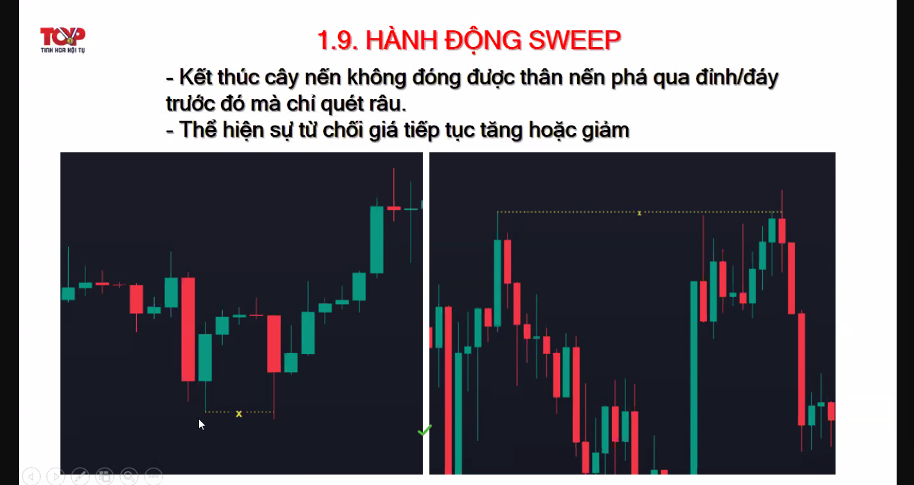
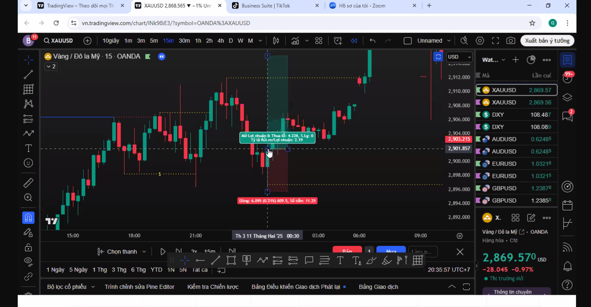
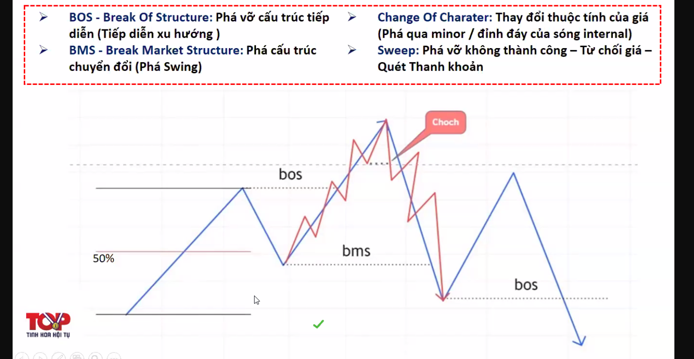
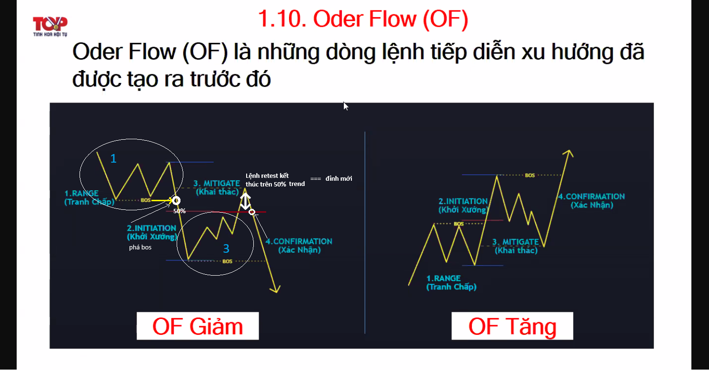

# Note Top 1 12/2/2025

Demo đánh như thật. Không thờ ơ.
Nhận định sai mà nhận ra thì đóng luôn, k cố chấp, k về bờ.

Chia sẻ: dạy cho ng khác, ntn mới thực sự hiểu.

## 1. Xu hướng: tiếp diễn, đảo chiều

### 1.1. tiếp diễn (bos)

- m15 swing: phá vỡ cấu trúc (bos - break of structure) (vd: giá đóng phá qua đỉnh/đáy, đỉnh cao hơn, đáy thấp hơn)
  => theo xu hướng đến khung h4
  => nhịp 2 an toàn hơn nhịp 1 (thường test nhịp 1, gấp đôi nhịp 2)

### 1.2. đảo chiều (choch)

- 2 choch, choch nhỏ choch lớn
- choch nhỏ phá đỉnh minor (tín hiệu)
- choch major (BMS - break market structure) => đảo chiều
- sweep là chỉ quét râu
- 
- sweep râu dưới dài mà đỏ thì lực mua yếu, còn râu dưới dài mà xanh thì lực mua mạnh (gọi là quét thanh khoản)
- nên để sl xa sweep khoảng 2 giá
- 

## 2. Cấu trúc

## 3. Order Flow (dòng chảy)

- tìm điểm hợp lưu (thuận xu hướng nhiều khung thời gian)

  - D1: ktr 1 lần/ngày
  - H4: ktr 8h, 12h, 16h, 20h
  - M15: tìm điểm entry. tìm bms

- hạn chế giao dịch ở giờ giao phiên (aka giữa các phiên, vd: 10h-12h)
- Á: 8h, Âu: 14h, Mỹ: 19h
- order flow: lệnh tiếp diễn xu hướng
- vd: 
