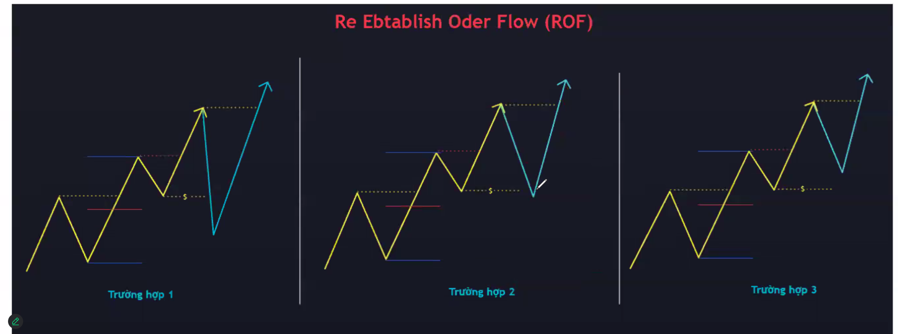
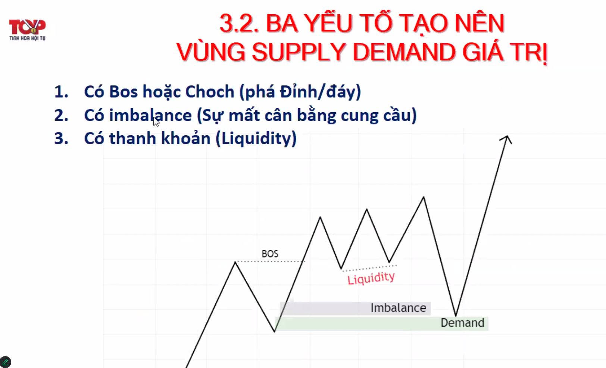
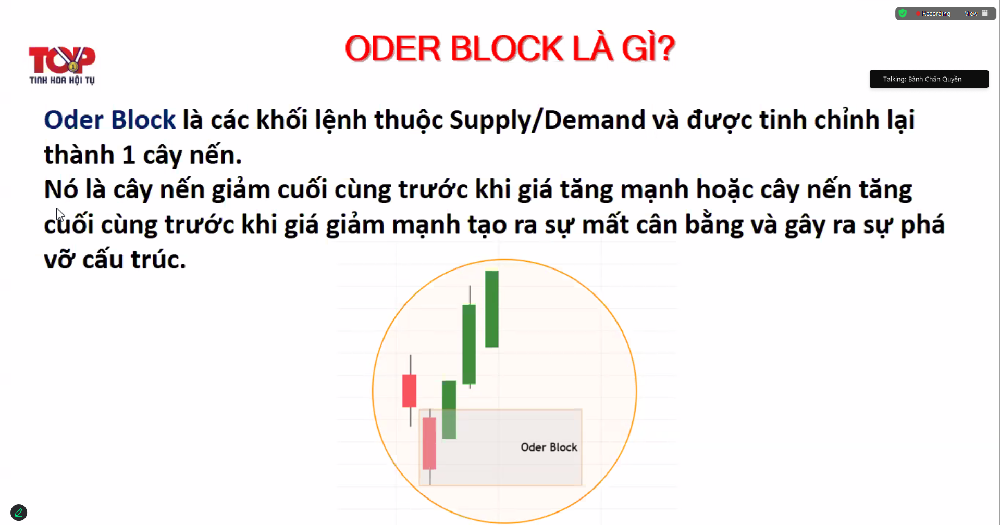
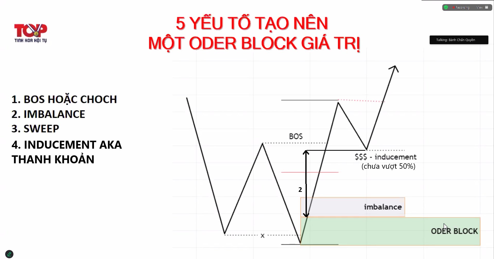

# Note Top 1 14/2/2025

Học xong phải biết vẽ order flow. Vào lệnh ở điểm 3 (khai thác) - gọi là thân cá. Đừng ham điểm 1, 2 (đầu cá).

## 1. Re-establish Order Flow (ROF)

- TH1: buy dưới 50%
- TH2: khi giá k về dưới 50%, đợi giá về lần thứ 2 (50% của swing mới) mua gấp đôi
- TH3: gãy cấu trúc, hơi rủi ro, phải cẩn thận, check cấu trúc của khung giờ lớn hơn

> luôn luôn để sl dưới đáy swing

## 2. Supply demand

- Supply: vùng mua mạnh
- Demand: vùng bán mạnh

### 2.1. 3 yếu tố tạo vùng supply demand giá trị

- Có bos hoặc choch (phá đỉnh/đáy)
- Có imbalance
- Có thanh khoản (liquidity aka minor aka chưa vượt qua 50%), còn có thể hiểu là chỗ đám đông để sl, chỗ này nên tránh.

## 3. Order Block (theo dấu cá mập)

- nến giảm cuối trước khi giá tăng mạnh (tính cả râu)

### 3.1. Yếu tố tạo order block giá trị

- Bos hoặc choch (yếu tố phá đỉnh)
- Imbalance (giá chưa về lần nào)
- Sweep
- Thanh khoản (inducement)
  => giải quyết một phần trường hợp 3 rof

