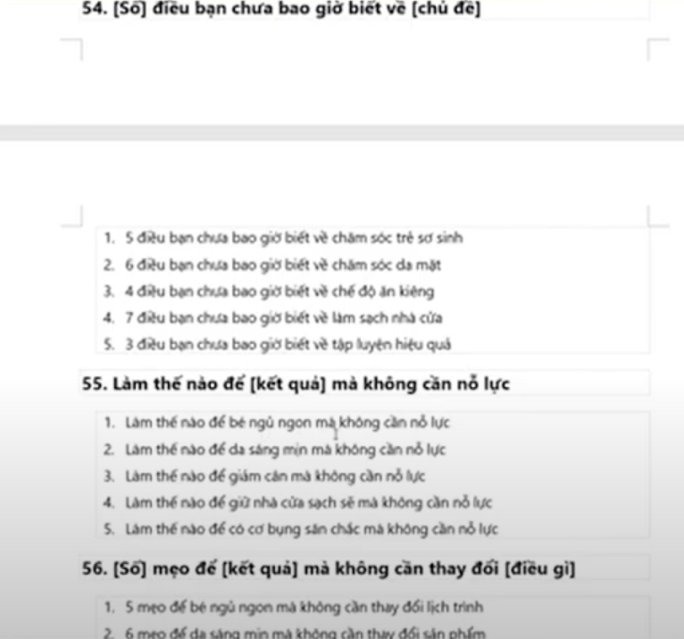

# Note topmax 12/2/2025

Dành cho các đối tượng yếu marketing

Giới thiệu sp đến kh (qc) qua các kênh:

- Fb ads
- TikTok
- Yt

## 1. Phễu marketing

1. Thu hút: giới thiệu ng dùng chưa biết về dv (vd qua bài viết, video của kol)
2. Chuyển đổi: kéo kh qua các kênh bán hàng (vd bán khóa học online -> giới thiệu sp)

   => biến kh tiềm năng thành kh trả tiền

3. Chăm sóc: cskh, giải quyết nhu cầu, tư vấn, trả lời câu hỏi
4. Affiliate: khuyến khích kh tiếp thị dv thông qua chương trình hoa hồng (vd: chương trình tiếp thị liên kết, mã giảm giá đặc biệt cho thành viên)

   => mở rộng kh tiềm năng mà không cần đầu tư vào quảng cáo

### Các sai lầm cơ bản

- bán hàng luôn ở giai đoạn 1, bán hàng cho kh lạnh (vd: yt qc khóa hoc, qc sp)

  => chi phí rất cao

> nên phân biệt giữa video thu hút (chia sẻ thông tin hữu ích, chia sẻ khóa học) vs video chuyển đổi (qc sp)

## 2. Phân loại kh: lạ - quen - thân - yêu (aka lạnh - ấm - nóng - yêu)

- Lạnh: thu hút bằng: qc qua short video, bài viết chia sẻ, kol review
- Ấm: chuyển đổi bằng: video dài, khóa học, email marketing, nhắn tin (LƯU Ý chưa bán hàng)
- Nóng: chăm sóc bằng: bán hàng, chia sẻ nhiều ưu đãi, khuyến mãi
- Yêu: biến kh thành các affiliate: mời kh join vào các cộng đồng, chia sẻ nội dung (biến kh thân thành kh trung thành)

## 3. Money in the list: tất cả doanh nghiệp xuất phát từ tập dữ liệu kh tiềm năng (aka list tên, sđt, email)

### Sự chủ động khi có tập dữ liệu

- k phụ thuộc qc
- k phụ thuộc nền tảng khác như fb, tiktok, yt

### Sai lầm

- Mua data, mua danh sách
- Spam tin nhắn, spam trong group
- Quét data group, fanpage

### 5 yếu tố cốt lõi của chiến dịch qc

- Hồ sơ kh: the list
- Content: nội dung qc (video hay bài viết hay livestream) -> nội dung qc nào thì phù hợp với đối tượng nào (vd: short thì nhắm tới giới trẻ, fb và yt thì nhắm tới đối tượng lớn hơn)
- Target: hiểu nhóm đối tượng kh (ng muốn khởi nghiệp hay chủ dn hay hs, sv)
- Qc: có 3 yếu tố trên thì chi phí qc đc tối ưu
- Kỹ thuật tối ưu

## 4. Phễu 4 tầng (phễu nd qc): AIDA

- Attention: 1s đầu gây chú ý
- Interest: giải quyết vấn đề, gây ra sự tò mò
- Desire: giới thiệu sp khiến kh khao khát, mong muốn sở hữu
- Action: kêu gọi kh mua (vd nhấn link, gọi sđt)
  > 3s đầu tiên quyết định 80% thành công của 1 video

Video vd phễu:

### TOP 100 mẫu câu HOOK

Cấu trúc phễu:

### Mục tiêu chuyển đổi là gì?

- Mua hàng trực tiếp
- Bình luận, nhắn tin
- Follow, tương tác
- Để lại thông tin, bấm vào link
